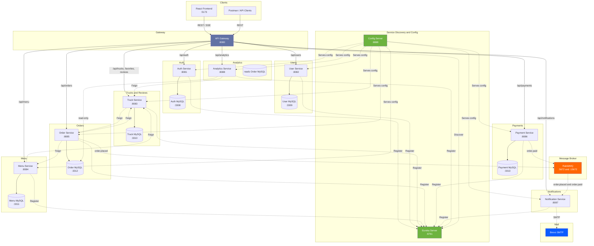
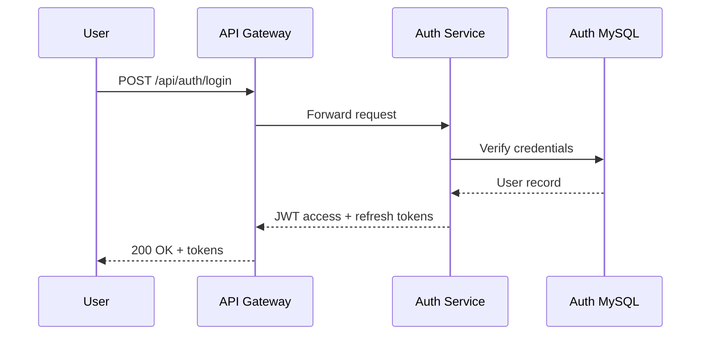
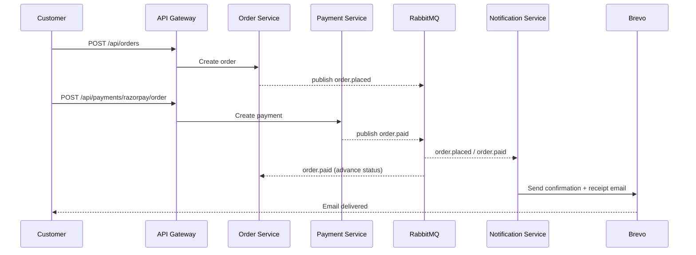
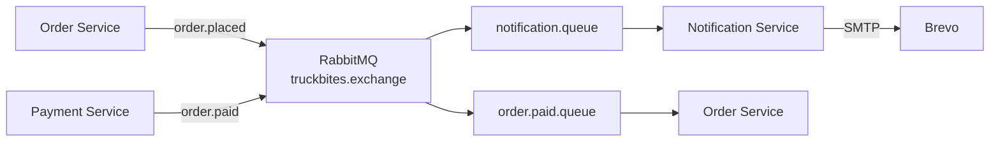

# 🚚 TruckBites

[](https://openjdk.org/projects/jdk/25/)
[](https://spring.io/projects/spring-boot)
[](https://react.dev)
[](https://docker.com)
[](https://github.com/features/actions)
[](LICENSE)

**TruckBites** is a full-stack microservices platform for food truck discovery, online ordering, and vendor management. 🍔 Customers browse nearby trucks by cuisine and location, place orders, pay, and leave reviews. 🧑‍🍳 Vendors manage trucks, menus, and orders through a real-time dashboard. 🛡️ Admins oversee the whole system from a centralized admin panel.

---

## 💡 Why TruckBites?

Unlike general-purpose food delivery apps, TruckBites is purpose-built for the mobile food truck model — trucks that move, keep irregular hours, and need lightweight tools rather than a heavyweight restaurant POS. It's also a reference implementation of a production-shaped microservices system: independent deployability, database-per-service, event-driven messaging, and observability baked in from the start, not bolted on.

---

## ✨ Key Features

- 🔐 JWT authentication with role-based access control (`CUSTOMER`, `VENDOR`, `ADMIN`)
- 🌐 Centralized routing through a Spring Cloud Gateway
- 🧭 Service discovery via Eureka, config via Spring Cloud Config
- 🚚 Truck discovery, search, favorites, and reviews
- 🧾 Live menu & inventory management for vendors
- 🛒 Order placement with real-time status updates over SSE
- 💳 Razorpay-powered checkout
- 📨 Event-driven order/payment notifications via RabbitMQ
- ✉️ Transactional email via Brevo SMTP
- 📊 Vendor sales analytics dashboard
- 🐳 One-command local stack via Docker Compose
- ⚙️ CI on every push via GitHub Actions

---

## 📈 Project Stats

| | |
|---|---|
| 🏗 Business microservices | 8 |
| 🗄 MySQL databases (one per service) | 6 |
| 🐳 Total containers in the stack | 18 |
| 🧪 Backend unit tests | 195 |
| 🔌 Services with Swagger/OpenAPI docs | 8 / 11 |
| 📨 Async event types | 2 (`order.placed`, `order.paid`) |

---

## ✅ Project Status

| Feature | Status |
|---|---|
| Authentication & RBAC | ✔️ Done |
| Truck discovery, favorites, reviews | ✔️ Done |
| Vendor dashboard & menu management | ✔️ Done |
| Order placement + live tracking (SSE) | ✔️ Done |
| Razorpay payments | ✔️ Done |
| Email notifications (RabbitMQ + Brevo) | ✔️ Done |
| Vendor analytics dashboard | ✔️ Done |
| Docker Compose deployment | ✔️ Done |
| Swagger / OpenAPI docs | ✔️ Done (8/11 services) |
| Gateway route for image upload | 🚧 In progress |
| Kubernetes deployment | 🚧 Planned |
| Mobile app | 🚧 Planned |

---

## 🛣 Roadmap

- [ ] Route `/api/upload` through the API Gateway
- [ ] Google Maps live truck location
- [ ] Push notifications
- [ ] Redis caching for hot read paths (truck search, menus)
- [ ] Elasticsearch-backed search
- [ ] Kubernetes manifests / Helm chart
- [ ] Native mobile app

---

## 📋 Table of Contents

- [Why TruckBites?](#-why-truckbites)
- [Key Features](#-key-features)
- [Project Stats](#-project-stats)
- [Project Status](#-project-status)
- [Roadmap](#-roadmap)
- [Architecture Overview](#-architecture-overview)
- [Sequence Flows](#-sequence-flows)
- [Service Matrix](#-service-matrix)
- [Tech Stack](#-tech-stack)
- [Project Structure](#-project-structure)
- [Prerequisites](#-prerequisites)
- [Quick Start (Docker Compose)](#-quick-start-docker-compose)
- [Development Setup](#-development-setup)
- [Testing](#-testing)
- [API Endpoints](#-api-endpoints)
- [Swagger / OpenAPI Docs](#-swagger--openapi-docs)
- [Environment Variables](#-environment-variables)
- [RabbitMQ Event Flow](#-rabbitmq-event-flow)
- [Troubleshooting](#-troubleshooting)
- [CI/CD](#-cicd)
- [License](#-license)

---

## 🏗 Architecture Overview



### 🧭 Startup Order

Containers start in strict dependency order via Docker Compose `depends_on` conditions:

| Stage | Containers | Notes |
|-------|-----------|-------|
| 1 | `eureka-server`, `rabbitmq` | Infrastructure, starts in parallel |
| 2 | `config-server` | After Eureka is healthy |
| 3 | `auth-mysql`, `user-mysql`, `truck-mysql`, `menu-mysql`, `order-mysql`, `payment-mysql` | 6 databases, in parallel |
| 4 | `auth-service`, `user-service`, `truck-service`, `payment-service`, `notification-service` | Tier-1 services, no Feign deps |
| 5 | `menu-service`, `order-service`, `analytics-service` | Tier-2, depend on tier-1 via Feign |
| 6 | `api-gateway` | Last — depends on all upstream services |

🧮 **Total: 18 containers** (2 infra + config-server + 6 databases + 8 business services + gateway).

---

## 🔀 Sequence Flows

### 🔑 Login



### 🛒 Place an Order



---

## 📊 Service Matrix

| # | Service | Port | Database | Persistence | Auth Required | Role(s) |
|---|---------|------|----------|-------------|---------------|--------|
| 1 | **API Gateway** | `8080` | — | — | Depends on route | — |
| 2 | **Auth Service** | `8081` | `auth-mysql:3308` | JPA (Evolve) | Mixed | Public / ADMIN |
| 3 | **User Service** | `8082` | `user-mysql:3309` | JPA (Evolve) | ✅ All | Any auth |
| 4 | **Truck Service** | `8083` | `truck-mysql:3310` | JPA (Evolve) | Mixed | Public / VENDOR / ADMIN |
| 5 | **Menu Service** | `8084` | `menu-mysql:3311` | JPA (Evolve) | Mixed | Public / VENDOR |
| 6 | **Order Service** | `8085` | `order-mysql:3312` | JPA (Evolve) | Mixed | CUSTOMER / VENDOR / ADMIN |
| 7 | **Payment Service** | `8086` | `payment-mysql:3313` | JPA (Evolve) | ✅ All | Any auth |
| 8 | **Notification Service** | `8087` | — | None (events only) | Mixed | — |
| 9 | **Analytics Service** | `8088` | `order-mysql` (read-only) | JdbcTemplate | ✅ All | VENDOR only |

### 🏭 Infrastructure

| Component | Port | Description |
|-----------|------|-------------|
| Eureka Server | `8761` | Service discovery (Spring Cloud Netflix Eureka) |
| Config Server | `8888` | Centralized configuration (Spring Cloud Config, native profile) |
| RabbitMQ | `5672` / `15672` | Message broker (AMQP + Management UI) |
| Brevo | external | SMTP relay for transactional email notifications |

---

## 🛠 Tech Stack

### ⚙️ Backend
- Java 25 + Spring Boot 3.5.5 + Spring Cloud 2025.0.0
- Spring Cloud Netflix Eureka — service discovery
- Spring Cloud Config — centralized config (native profile, served from `config-repo/`)
- Spring Cloud Gateway — API gateway (load-balanced routing via `lb://`)
- Spring Data JPA + MySQL 8 — one database per service
- Spring Security + JWT (HMAC-SHA256) — authentication & role-based authorization (`CUSTOMER`, `VENDOR`, `ADMIN`)
- Spring Cloud OpenFeign — inter-service HTTP calls with Resilience4j circuit breakers and fallback factories
- Spring Cloud Stream / RabbitMQ — async event-driven communication
- Spring Boot Starter Mail — SMTP email sending via Brevo
- SpringDoc OpenAPI — Swagger UI at `/swagger-ui.html` per service
- Lombok — boilerplate reduction

### 🎨 Frontend
- React 19 (Vite) with Tailwind CSS 4
- Recharts — sales analytics charts
- Axios — HTTP client with JWT interceptors
- React Router — client-side routing with protected routes
- Vitest — unit tests (jsdom)

### 🐳 DevOps
- Docker Compose — 18-container local deployment
- Multi-stage Dockerfiles (Maven build → JRE runtime)
- GitHub Actions CI — matrix backend tests + frontend checks
- Healthchecks on all databases and RabbitMQ

---

## 📁 Project Structure

```
truckbites/
│
├── .github/workflows/          # GitHub Actions CI
├── config-repo/                # Spring Cloud Config repository (served by config-server)
├── infrastructure/
│   └── scripts/                # seed scripts, e2e-test.sh, reset-vendor-truck-data.sh
├── services/                   # Microservices (one folder per service)
│   ├── api-gateway/            #   8080 - Spring Cloud Gateway
│   ├── auth-service/           #   8081 - register/login/JWT + password reset
│   ├── user-service/           #   8082 - profiles, memberships, vendor plans
│   ├── truck-service/          #   8083 - trucks, reviews, favorites, uploads
│   ├── menu-service/           #   8084 - menu items + inventory
│   ├── order-service/          #   8085 - orders + SSE live tracking
│   ├── payment-service/        #   8086 - Razorpay payments
│   ├── notification-service/   #   8087 - email notifications (RabbitMQ)
│   ├── analytics-service/      #   8088 - vendor sales analytics
│   ├── config-server/          #   8888 - Spring Cloud Config
│   └── eureka-server/          #   8761 - service discovery
├── shared/
│   └── truckbites-common/      # Shared DTOs / utilities used by all services
├── frontend/
│   └── truckbites-frontend/    # React 19 + Vite SPA (:5173)
├── testing/
│   ├── e2e/                    # api-test.sh (full gateway E2E flow)
│   └── postman/                # TruckBites.postman_collection.json
├── .env                        # Local secrets (gitignored — required)
├── docker-compose.yml          # 18-container local stack
├── LICENSE
└── README.md
```

---

## 📋 Prerequisites

- [Docker Desktop](https://www.docker.com/products/docker-desktop/) 4.x+
- [Java 25](https://jdk.java.net/25/) (for local development without Docker)
- [Node.js 22+](https://nodejs.org/) (for frontend development)
- [Maven 3.9+](https://maven.apache.org/) (for building services locally)

---

## 🚀 Quick Start (Docker Compose)

### 1️⃣ Clone and configure

```bash
git clone https://github.com/your-org/truckbites.git
cd truckbites
```

Create a `.env` file in the repo root with the following:

```env
MYSQL_ROOT_PASSWORD=<root db password>
JWT_SECRET=<generated secret>          # openssl rand -hex 32
RAZORPAY_KEY_ID=<razorpay key id>
RAZORPAY_KEY_SECRET=<razorpay key secret>

# Optional — omit to skip email sending
BREVO_SMTP_LOGIN=<optional>
BREVO_SMTP_KEY=<optional>
FRONTEND_URL=http://localhost:5173
MAIL_FROM=TruckBites <you@example.com>
```

> ⚠️ **`.env` is required.** `JWT_SECRET`, `MYSQL_ROOT_PASSWORD`, and the Razorpay keys have no hardcoded defaults — the stack refuses to start without them. `BREVO_SMTP_LOGIN` / `BREVO_SMTP_KEY` are only needed if you want the notification service to actually send emails; without them it still starts, it just skips sending.
>
> 🏃 Running a service standalone with `mvn spring-boot:run`? Export the same variables from `.env` first — services no longer ship hardcoded defaults.
>
> 🔁 If you previously exported `JWT_SECRET` in your shell, `unset JWT_SECRET` first — a stale shell export silently overrides `.env`.

### 2️⃣ Start the stack

```bash
docker compose up -d --build
```

All 18 containers start in dependency order (see [Startup Order](#-startup-order)). Wait for the `api-gateway` healthcheck to pass, then it's go time 🎉

| Service | URL |
|---------|-----|
| Frontend | <http://localhost:5173> |
| API Gateway | <http://localhost:8080/api/...> |
| Eureka | <http://localhost:8761> |
| RabbitMQ management | <http://localhost:15672> (`guest` / `guest`) |

### 3️⃣ Seed demo data (optional)

```bash
bash infrastructure/scripts/e2e-test.sh          # quick smoke test against the gateway
bash infrastructure/scripts/seed-vendors.cjs     # seed vendor accounts + trucks
```

---

## 🔧 Development Setup

### ⚙️ Backend (without Docker)

```bash
# 1. Install the shared module into your local Maven repo (required once)
mvn -f shared/truckbites-common/pom.xml install -DskipTests

# 2. Export the env vars used by the services (source your .env)
set -a; source .env; set +a

# 3. Run a service (start config-server + eureka-server first for full discovery)
mvn -f services/auth-service/pom.xml spring-boot:run
```

> Config Server serves from `config-repo/` — run locally, it resolves `file:../../config-repo` automatically. For databases, either use the Docker MySQL containers or run services with the `local` profile (`application-local.yml`).

### 🎨 Frontend

```bash
cd frontend/truckbites-frontend
npm install
npm run dev        # http://localhost:5173 (VITE_API_BASE_URL from .env)
```

The frontend reads `frontend/truckbites-frontend/.env` for `VITE_API_BASE_URL` and `VITE_RAZORPAY_KEY_ID` (copy from `.env.example` in that directory).

---

## 🧪 Testing

### ✅ Backend unit tests

Every service has `src/test/java` tests using an in-memory H2 database — no Docker or MySQL needed:

| Service | Tests |
|---------|-------|
| auth-service | 4 — AuthController, AuthService, JwtUtil, RateLimitingFilter |
| user-service | 3 — UserController, UserService, JwtUtil |
| truck-service | 3 — TruckController, TruckService, JwtUtil |
| menu-service | 3 — MenuController, MenuService, JwtUtil |
| order-service | 3 — OrderController, OrderService, JwtUtil |
| payment-service | 3 — PaymentController, PaymentService, JwtUtil |
| analytics-service | 3 — AnalyticsController, AnalyticsService, JwtUtil |
| notification-service | 1 — NotificationService |
| api-gateway / config-server / eureka-server | — infrastructure, no business logic |

🧪 **Total: 195 unit tests across 8 services** (H2 in-memory, no Docker needed). Test resources disable the Config Server (`src/test/resources/bootstrap.yml`) so runs are deterministic regardless of whether the stack is up.

```bash
mvn -f services/auth-service/pom.xml test        # run one service's tests

# run all services' tests
mvn -f shared/truckbites-common/pom.xml install -DskipTests && \
for s in services/*/; do mvn -B -q -f "$s/pom.xml" test; done
```

### ✅ Frontend tests

```bash
cd frontend/truckbites-frontend
npm test          # vitest run (jsdom)
```

### 🔗 E2E API tests

```bash
# against the running stack (requires the gateway on :8080)
bash testing/e2e/api-test.sh
bash infrastructure/scripts/e2e-test.sh
```

### 📮 Postman

Import `testing/postman/TruckBites.postman_collection.json` into Postman.

---

## 🔌 API Endpoints

All requests go through the **API Gateway** (`http://localhost:8080`). JWT-authenticated endpoints require `Authorization: Bearer <token>`.

| Method | Path | Service | Access |
|--------|------|---------|--------|
| POST | `/api/auth/register` | auth | Public |
| POST | `/api/auth/login` | auth | Public |
| POST | `/api/auth/refresh` | auth | Any auth |
| POST | `/api/auth/forgot-password`, `/api/auth/reset-password` | auth | Public |
| GET/PUT | `/api/auth/users` | auth | ADMIN |
| GET | `/api/users/me`, `/api/users/profile` | user | Any auth |
| GET/POST/PATCH | `/api/users/memberships`, `/api/users/vendor-plan` | user | Any auth |
| GET | `/api/trucks/search`, `/api/trucks/{id}` | truck | Public |
| GET/POST/PATCH/DELETE | `/api/trucks` (vendor mgmt) | truck | VENDOR |
| GET/POST/DELETE | `/api/favorites/**` | truck | CUSTOMER |
| GET/POST | `/api/reviews/truck/{id}` | truck | Public / CUSTOMER |
| GET/POST/PATCH | `/api/trucks/{id}/hours` | truck | VENDOR |
| GET/POST/PATCH | `/api/menu`, `/api/menu/truck/{id}`, `/api/menu/{id}/inventory` | menu | Public / VENDOR |
| GET/POST | `/api/orders`, `/api/orders/my-orders`, `/api/orders/{id}` | order | CUSTOMER / VENDOR / ADMIN |
| GET | `/api/orders/truck/{truckId}` | order | VENDOR |
| PATCH | `/api/orders/{id}/status` | order | VENDOR |
| GET | `/api/orders/events?truckId={id}` | order | VENDOR (SSE live updates) |
| POST | `/api/payments/razorpay/order` | payment | Any auth |
| GET | `/api/payments/order/{orderId}` | payment | Any auth |
| GET | `/api/analytics/truck/{truckId}/sales` | analytics | VENDOR |
| GET | `/api/analytics/truck/{truckId}/top-items` | analytics | VENDOR |
| GET | `/api/analytics/truck/{truckId}/order-summary` | analytics | VENDOR |

> ⚠️ `POST /api/upload` (truck image upload) is served by truck-service but is **not yet routed by the gateway** — call it directly on `:8083` until a gateway route is added.

---

## 📖 Swagger / OpenAPI Docs

Each business service exposes interactive Swagger UI and a JSON spec (`/v3/api-docs`) via SpringDoc:

| Service | Port | Swagger UI |
|---------|------|-----------|
| auth-service | 8081 | <http://localhost:8081/swagger-ui.html> |
| user-service | 8082 | <http://localhost:8082/swagger-ui.html> |
| truck-service | 8083 | <http://localhost:8083/swagger-ui.html> |
| menu-service | 8084 | <http://localhost:8084/swagger-ui.html> |
| order-service | 8085 | <http://localhost:8085/swagger-ui.html> |
| payment-service | 8086 | <http://localhost:8086/swagger-ui.html> |
| notification-service | 8087 | <http://localhost:8087/swagger-ui.html> |
| analytics-service | 8088 | <http://localhost:8088/swagger-ui.html> |

**8/11 services** ship SpringDoc (`springdoc-openapi-starter-webmvc-ui`) with an `OpenApiConfig` (info, security scheme, server URL). `api-gateway` (Spring Cloud Gateway / WebFlux), `config-server`, and `eureka-server` have no Swagger UI — they expose no business API. Controllers are annotated with `@Operation` / `@ApiResponse` / `@SecurityRequirement`.

---

## 🔐 Environment Variables

All secrets are centralized in the root `.env` (gitignored) and consumed via `docker compose` / Spring `${...}` placeholders:

| Variable | Required | Description |
|----------|----------|-------------|
| `MYSQL_ROOT_PASSWORD` | ✅ | Root password for all 6 MySQL containers |
| `JWT_SECRET` | ✅ | HMAC-SHA256 signing secret (≥ 64 hex chars, `openssl rand -hex 32`) |
| `RAZORPAY_KEY_ID` | ✅ | Razorpay public key id (server + checkout) |
| `RAZORPAY_KEY_SECRET` | ✅ | Razorpay key secret (server-side only) |
| `BREVO_SMTP_LOGIN` | ⭕ | Brevo SMTP login (notification emails) |
| `BREVO_SMTP_KEY` | ⭕ | Brevo SMTP key |
| `FRONTEND_URL` | ⭕ | Base URL for email CTA links (default `http://localhost:5173`) |
| `MAIL_FROM` | ⭕ | Sender address for transactional emails |
| `VITE_API_BASE_URL` | frontend | Frontend → gateway base URL (`frontend/truckbites-frontend/.env`) |
| `VITE_RAZORPAY_KEY_ID` | frontend | Razorpay key id for browser checkout (same file) |

---

## 🔄 RabbitMQ Event Flow

Async events are published to the `truckbites.exchange` topic exchange and consumed by the notification service (and internally by order-service):



| Event | Producer | Consumer | Purpose |
|-------|----------|----------|---------|
| `order.placed` | order-service | notification-service | Order confirmation email |
| `order.paid` | payment-service | notification-service, order-service | Payment receipt email + order status advance |

---

## 🩺 Troubleshooting

| Symptom | Likely Cause | Fix |
|---------|-------------|-----|
| Stack refuses to start / crashes on boot | Missing `.env` or a required variable unset | Confirm `MYSQL_ROOT_PASSWORD`, `JWT_SECRET`, `RAZORPAY_KEY_ID`, `RAZORPAY_KEY_SECRET` are all set in the root `.env` |
| `401 Unauthorized` right after changing `JWT_SECRET` | A stale `JWT_SECRET` exported in your shell is overriding `.env` | Run `unset JWT_SECRET` and restart the service/stack |
| `mvn spring-boot:run` fails with missing property errors | Env vars from `.env` weren't exported into the shell | Run `set -a; source .env; set +a` before starting the service |
| `POST /api/upload` returns 404 through the gateway | Upload route isn't registered on the gateway yet | Call truck-service directly on `:8083` |
| A service can't resolve config on local `mvn` run | Config Server not reachable / wrong relative path | Start `config-server` first, or run with the `local` profile (`application-local.yml`) |
| Notification emails aren't sending | `BREVO_SMTP_LOGIN` / `BREVO_SMTP_KEY` not set | Expected — these are optional; the service starts fine and just skips sending |
| `mvn -f services/*/pom.xml` fails with missing shared classes | `truckbites-common` not installed locally | Run `mvn -f shared/truckbites-common/pom.xml install -DskipTests` first |

---

## 🤖 CI/CD

GitHub Actions (`.github/workflows/ci.yml`) runs on every push to `main`/`dev` and on pull requests:

1. **Validate docker-compose** — `docker compose config -q`
2. **Build shared module** — `shared/truckbites-common`
3. **Backend matrix** — every service compiled and its unit tests run on JDK 25 (Surefire reports uploaded as artifacts)
4. ### 🎨 Frontend — `npm ci` → oxlint → Vitest unit tests → production build

---

## 📄 License

See [LICENSE](LICENSE).
